<!-- ### Hi there 👋 -->

<!--
**KirillKovalkin/KirillKovalkin** is a ✨ _special_ ✨ repository because its `README.md` (this file) appears on your GitHub profile.

Here are some ideas to get you started:

- 🔭 I’m currently working on ...
- 🌱 I’m currently learning ...
- 👯 I’m looking to collaborate on ...
- 🤔 I’m looking for help with ...
- 💬 Ask me about ...
- 📫 How to reach me: ...
- 😄 Pronouns: ...
- ⚡ Fun fact: ...
-->

## Hello, I'm Kirill 👋

### 💻 QA Automation Engineer (Python) at  Belarus

---

### 🚀 About Me

- Currently learning **Python** and **Testing Theory**  
- Passionate about automation, quality assurance, and clean code  
- Open to collaboration and new challenges

---

### 🛠️ Tech Stack

**Programming & Scripting**  

**Testing & Automation**  

**DevOps & Infrastructure**  

---

### ✉️ How to reach me: 

---

### 📊 GitHub Stats

